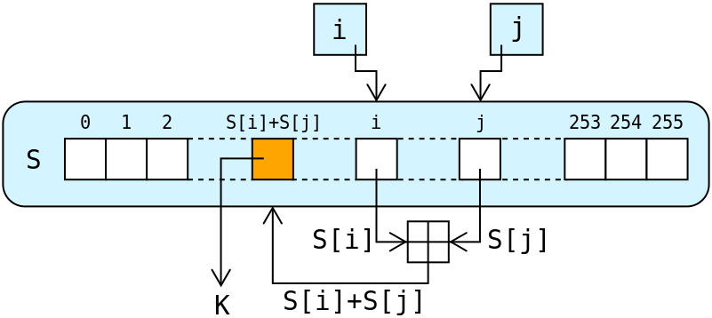
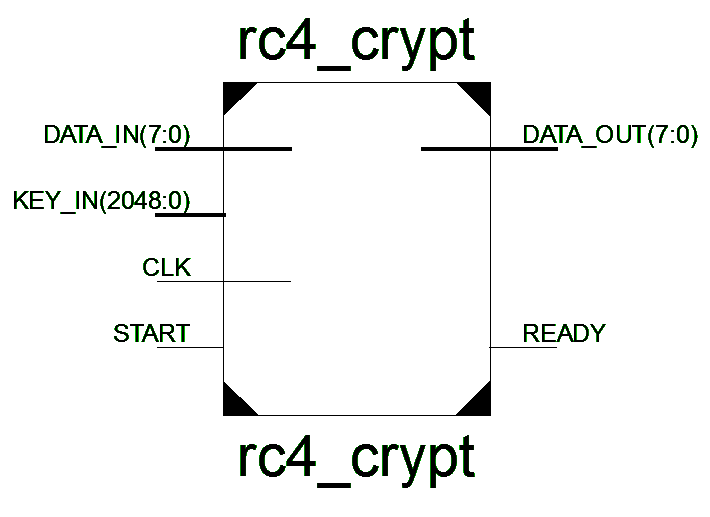
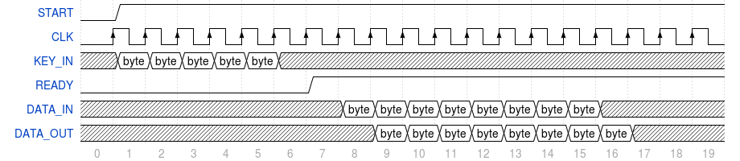
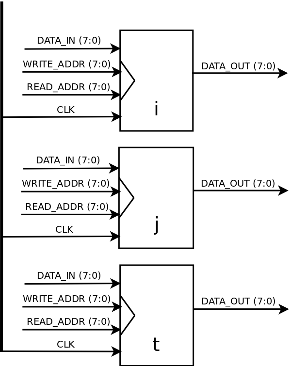
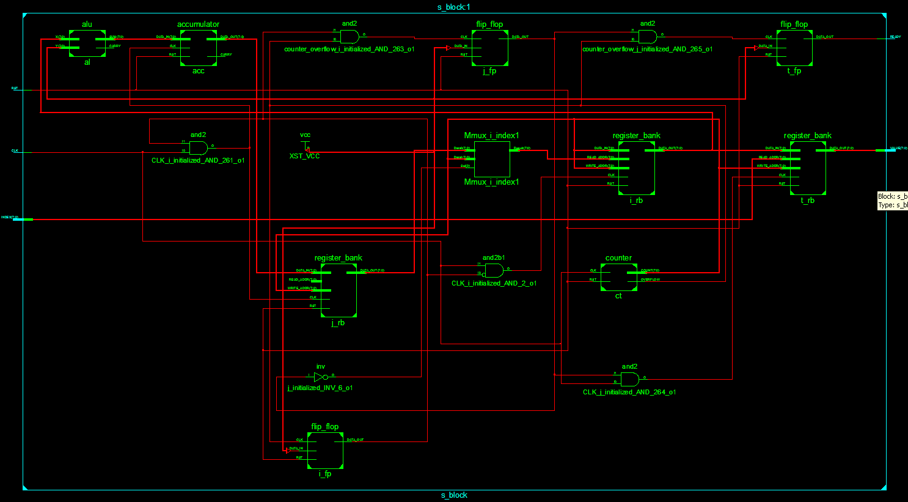

===========================================
A hardware implementation of the RC4 cipher
===========================================

:Author: Silviu Tantos
:Student ID: 166781
:Contact: me@razius.com
:Website: `razius.com <http://razius.com>`_
:Date: $Date: 2014-04-16 $
:Description: A presentation of a simple hardware implementation of the RC4 stream cipher using VHDL as the implementation language.

.. raw:: pdf

    PageBreak oneColumn

.. contents:: Table of contents

.. section-numbering::
    :suffix: :

.. raw:: pdf

    PageBreak oneColumn

.. target-notes::

.. footer:: ###Page### / ###Total###

Abstract
========

In this paper I'm gonna present a simple hardware implementation of the RC4 stream cipher using the VHDL language and test it on a Xilinx FPGA board.

The implementation uses a total of 756 clock ticks to go through the KSA phase and is implemented using a mixture of behavioral design and combinatorial logic.

Introduction
============

Symmetric-key encryption
------------------------

Symmetric-key algorithms are a type of cryptography algorithms that use the same cryptographic keys for both the encryption of the plaintext and the decryption of the ciphertext.

.. figure:: img/symmetric-key-encryption.png
    :align: center
    :width: 70%

A drawback of symmetric key encryption is that both parties need to have access to the secret keys and the keys need to be known beforehand.

Symmetric-key algorithms are divided into two distinct types based on how the data is encrypted.

* Stream ciphers
* Block ciphers

Some popular symmetric-key algorithms include AES, Blowfish, RC4, and 3DES.

Stream ciphers
--------------

Stream ciphers are a type of symmetric-key encryption algorithms that process data bit by bit (as a stream) encrypting them one at a time. This is in contrast to block ciphers that process the data in large blocks.

Most stream ciphers work by transforming the key into a long sequence of random bits which are then combined with the data needed to be encrypted by using a binary XOR.

Stream ciphers typically execute at a higher speed than block ciphers and have lower memory requirements and hardware complexity.

The RC4 stream cipher
=====================

RC4 is one of the most widely used stream cipher, it has been integrated into TLS/SSL, WEP, Remote Desktop Protocol, SSH, BitTorrent and Skype ammong others.

RC4, as any stream cipher, generates a pseudorandom stream of bits, called a keystream, that is used for encryption by combining it with the plaintext data using a bit-wise exclusive-or (XOR) binary operation. To generate the keystream, the cipher makes use of a secret internal state which consists of two parts:

* A permutation of all 256 possible bytes.
* Two 8-bit index-pointers.

The algorithm consists of two stages, the first state is called the key-scheduling algorithm (KSA) and initializes the permutation with a variable length key, typically between 40 and 256 bits, using. Once this has been completed, the pseudo-random generation algorithm (PRGA) generates the stream of bits thath will be XOR'ed with the plain text data.

Key-scheduling algorithm (KSA)
------------------------------

During the key-scheduling phase the algorithm initializes the array "S" with incremental bit permutations (values from 0 to 255). The *keylength* is the number of bytes in the key and can be a minimum of 1 byte (not really recomended) to a maximum of 256 bytes, with a typical value between 5 and 16 bytes that corresponde to a key length of 40 to 128 bits.

First, the array "S" is initialized to the identity permutation. S is then processed for 256 iterations in a similar way to the main PRGA, but also mixes in bytes of the key at the same time.

.. code-block:: None

    for i from 0 to 255
        S[i] := i
    endfor
    j := 0
    for i from 0 to 255
        j := (j + S[i] + key[i mod keylength]) mod 256
        swap values of S[i] and S[j]
    endfor

Pseudo-random generation algorithm (PRGA)
-----------------------------------------

For as many iterations as are needed, the PRGA modifies the state and outputs a byte of the keystream. In each iteration, the PRGA increments i, looks up the ith element of S, S[i], and adds that to j, exchanges the values of S[i] and S[j], and then uses the sum S[i] + S[j] (modulo 256) as an index to fetch a third element of S, (the keystream value K below) which is XORed with the next byte of the message to produce the next byte of either ciphertext or plaintext. Each element of S is swapped with another element at least once every 256 iterations.

.. code-block:: None

    i := 0
    j := 0
    while GeneratingOutput:
        i := (i + 1) mod 256
        j := (j + S[i]) mod 256
        swap values of S[i] and S[j]
        K := S[(S[i] + S[j]) mod 256]
        output K
    endwhile

    A visual representation of the RC4 algorithm

The decryption is performed the same way since exclusive-or with given data is an involution (a function f that is its own inverse).

Because it is essentially a look-up table and does not make use of shift registers it is extremely fast and its design is simple, making it easy to implement in hardware.

VHDL implementation of RC4
==========================

To simplify the implementation a few restrictions are put in place, the length of the key that will be used to generate the keystream will be limited to a fixed size of 256 bytes and it will be read from a static file and reading from ``KEY_IN`` and ``DATA_IN`` will be done one bit per clock cycle.

Overview
---------

Setting the ``START`` pin to HIGH will trigger the beginning of the cryptographic operation by starting to read the key from the KEY port and use it to initialize the internal state. When the initialization is done and the keystream is ready to be generated the output of the ``READY`` pin will be set to HIGH signaling that the circutry is ready to accept data on the ``DATA_IN`` port, any data that is outputed during the initialization phase on the ``DATA_OUT`` port should be discarded and considered garbage.

    RC4 Chip schematics

    RC4 Timing Diagram

Internal architecture
---------------------

The internal architecture consists of two distinct blocks, a control block and a storage block.

The storage block and KSA phase
~~~~~~~~~~~~~~~~~~~~~~~~~~~~~~~~

The storage block holds the permutation values (the "S" array) and consists of three 256 bytes register banks (memory cells), the *i* and *j* blocks are used during the key-scheduling algorithm (KSA) phase for swapping values and are ignored during the pseudo-random generation algorithm (PRGA) phase and the *t* block that holds the final permutation values that are used in the PRGA phase.

Each register bank consists of 256 register cells that can hold 8 bits, giving a total of 256 bytes, and an address decoder to address each individual register cell. The operation of a register bank is really simple, the bits comming in from the ``DATA_IN`` port are written to the register cell located at addresss (index) ``WRITE_ADDR`` when the ``CLK`` pin is pulled HIGH, the bits from the register cell located at address ``READ_ADDR`` are outputed on the ``DATA_OUT`` port without having to pull any pin to HIGH.

    i, j and t register banks sharing a common CLK signal

The KSA phase is divided into two states, the first part initializes the *i* block linearly with byte values from 0 to 255 using generated values from a generic counter block.

The second part mixes in bytes of the key with the identity permutation, it uses an alu to add the S permutation  and key values and an accumulator to add it to the previous value, the result is saved in the t block.

The KSA phase is practically implemented as a state machine that inititializes memory blocks using the results of the previous state. For each state, after completion, a D flip-flop is set to signal the completion of the state.

The KSA phase needs in total 768 clock cycles to complete, 256 clock ticks for the first state and 512 ticks for the second state.

    Storage block schematics

The control block and PRGA phase
~~~~~~~~~~~~~~~~~~~~~~~~~~~~~~~~

Bibliography
============

* http://en.wikipedia.org/wiki/RC4, Wikipedia: RC4, 18th of April 2014
* http://cryptanalysis.eu/blog/2013/03/15/ssltls-broken-again-a-weakness-in-the-rc4-stream-cipher/, SSL/TLS broken again – A weakness in the RC4 stream cipher, 18th of April 2014
* https://www.youtube.com/watch?v=riIp6EQOJOg, Stream ciphers: RC4, 18th of April 2014
* https://www.youtube.com/watch?v=ySZvE9vOfEQ, Block ciphers: Feistel cipher, 18th of April 2014
* http://www.ece.unm.edu/~jimp/vlsi/slides/vhdl.html, VHDL introduction, 1st of May 2014
